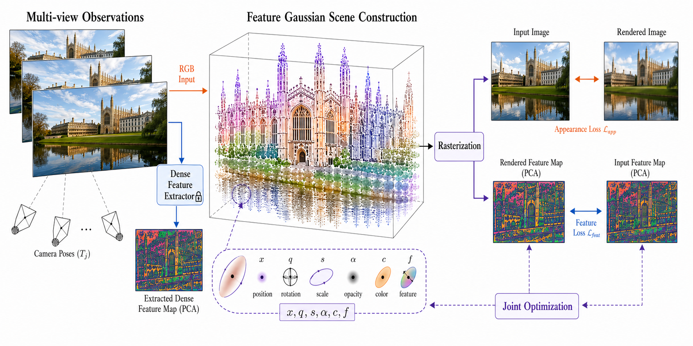

# LoFG: Unified Feature Gaussian Representation for Robust Camera Relocalization


**Authors**

- Zhendong Xiao¹
- Ziling Wen¹
- Jun Yin¹
- Wu Wei¹\*

¹ South China University of Technology &nbsp;&nbsp;·&nbsp;&nbsp; \* Corresponding author

<p align="center">
  
</p>

## Overview

LoFG is a unified, localization-oriented Feature Gaussian representation for robust camera relocalization. From a single scene model, LoFG:

- builds a localization-oriented Feature Gaussian scene;
- induces compact Gaussian landmarks for initial pose recovery;
- renders dense feature fields and depth maps for pose refinement.

<p align="center">
  
  <br>
  <em>Overview of the LoFG pipeline.</em>
</p>

## News

- TODO: Code release for The Visual Computer submission.
- TODO: Zenodo DOI.

## Installation

LoFG is developed and tested on the **NVIDIA RTX 5090 (Blackwell, sm_120)**. The following toolchain is recommended:

- **GPU**: NVIDIA RTX 5090 (or any sm_120 Blackwell card)
- **CUDA**: 12.8
- **PyTorch**: ≥ 2.7 (cu128 wheels)
- **Python**: ≥ 3.10

Example environment (exact versions will be pinned at camera-ready release):

```bash
# TODO: finalize environment for RTX 5090 / CUDA 12.8
conda create -n lofg python=3.10 -y
conda activate lofg

# TODO: pin torch / torchvision versions
pip install torch torchvision --index-url https://download.pytorch.org/whl/cu128

pip install -r requirements.txt

# Submodules
pip install submodules/simple-knn
pip install submodules/gsplat  # TODO: verify gsplat build for sm_120
```

> Note: the exact package versions that reproduce the manuscript results will be frozen and published together with the camera-ready code release.

## Data Preparation

LoFG is evaluated on two public camera relocalization benchmarks:

- [Microsoft 7-Scenes](https://www.microsoft.com/en-us/research/project/rgb-d-dataset-7-scenes/)
- [Cambridge Landmarks](https://www.repository.cam.ac.uk/handle/1810/251342/)

Expected folder layout:

```
datasets/
├── 7scenes/
│   ├── chess/
│   ├── fire/
│   ├── heads/
│   ├── office/
│   ├── pumpkin/
│   ├── redkitchen/
│   └── stairs/
└── cambridge/
    ├── KingsCollege/
    ├── OldHospital/
    ├── StMarysChurch/
    ├── ShopFacade/
    └── GreatCourt/
```


## Running LoFG


### Evaluation

- TODO: Coming soon.


